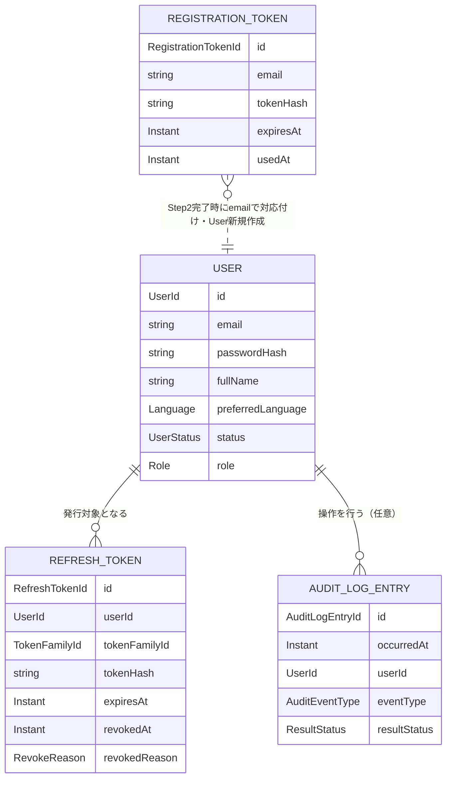

# UNIT-02 ユーザ登録・認証 - Domain Entities

business-rules.mdで定義したルールに対応するドメインエンティティを定義する。永続化技術（テーブル定義・カラム型等）の詳細はNFR Design／Code Generationステージで確定する。ここでは論理的な属性・関係のみを扱う。

---

## 1. User

アプリケーションの利用者（一般ユーザ・管理者）を表す。

| 属性 | 型 | 説明 |
|---|---|---|
| `id` | UserId | 一意識別子 |
| `email` | String | メールアドレス（全ステータスを通じて一意、BR-REG-06訂正版）。`REJECTED`・`DISABLED`いずれのステータスでも、同一メールアドレスでの新規登録（Step1やり直し）は許可しない |
| `passwordHash` | String | 適応型ハッシュアルゴリズムでハッシュ化されたパスワード（BR-PWD-03） |
| `fullName` | String | 氏名（BR-REG-05、Step2で収集） |
| `preferredLanguage` | Language | 言語設定（`ja`/`en`、BR-REG-05、Step2で収集） |
| `status` | UserStatus | `PENDING`/`APPROVED`/`REJECTED`/`DISABLED`（BR-REG-01） |
| `role` | Role | `USER`/`ADMIN` |
| `createdAt` | Instant | 登録完了（Step2）日時 |
| `statusChangedAt` | Instant | 直近のステータス変更日時 |
| `statusChangedBy` | UserId（nullable） | 直近のステータス変更を行った管理者。初期管理者ブートストラップ等、操作者が存在しない遷移ではnull |

**不変条件**: `status`が`APPROVED`のユーザのみログイン可能（BR-REG-03）。

---

## 2. RegistrationToken

2段階登録フローのStep1〜Step2間で使用する、メール確認・パスワード設定用のトークン（BR-REG-02）。

| 属性 | 型 | 説明 |
|---|---|---|
| `id` | RegistrationTokenId | 一意識別子 |
| `email` | String | 対象メールアドレス（Step2完了時点でUser.emailに引き継ぐ） |
| `tokenHash` | String | トークンのハッシュ値（平文は保存しない） |
| `expiresAt` | Instant | 有効期限（デフォルト発行から3時間、`mm.app.user-registration.token-expiry`） |
| `usedAt` | Instant（nullable） | 使用済み（Step2完了）日時。null＝未使用 |
| `createdAt` | Instant | 発行日時 |

**不変条件**:
- 同一`email`に対し、同時に有効な（未使用かつ未失効の）トークンは高々1件（BR-REG-02、新規発行時に旧トークンを無効化する）
- `usedAt`が設定済みのトークンは再利用不可（Step2の再実行を拒否）

**Userとの関係**: Step2完了までUserレコードは存在しないため、直接の外部キー関係は持たない（`email`で対応付ける）。Step2完了時にUserレコードが新規作成される。

---

## 3. RefreshToken

JWTアクセストークンと対をなす、ローテーション・再利用検知対象のリフレッシュトークン（BR-TOKEN-01〜03）。

| 属性 | 型 | 説明 |
|---|---|---|
| `id` | RefreshTokenId | 一意識別子 |
| `userId` | UserId | 発行対象ユーザ（外部キー） |
| `tokenFamilyId` | TokenFamilyId | トークンファミリID。ログイン時に新規採番、ローテーション時は引き継ぐ |
| `tokenHash` | String | トークンのハッシュ値（平文は保存しない） |
| `issuedAt` | Instant | 発行日時 |
| `expiresAt` | Instant | 有効期限（デフォルト24時間、`mm.app.jwt.refresh-token-expiry`） |
| `revokedAt` | Instant（nullable） | 失効日時。null＝有効 |
| `revokedReason` | RevokeReason（nullable） | `ROTATED`（ローテーションによる無効化）/ `REUSE_DETECTED`（再利用検知による一括失効）/ `LOGOUT`（ログアウトによる失効）/ `ADMIN_DISABLED`（管理者によるアカウント無効化に伴う失効。business-logic-model.md §3、レビュー指摘の反映） |

**不変条件**:
- 同一`tokenFamilyId`内で`revokedReason = REUSE_DETECTED`のトークンが1件でも存在する場合、同一ファミリの全トークンは失効済みでなければならない（BR-TOKEN-02）
- 1つのRefreshTokenは1回のみリフレッシュに使用可能（使用時に`ROTATED`として即座に失効させる）
- Userが`DISABLED`に遷移した時点で、当該`userId`に紐づく有効な（`revokedAt`がnullの）RefreshTokenは存在してはならない（`ADMIN_DISABLED`として一括失効。複数端末・複数トークンファミリにまたがる全件が対象）

**Userとの関係**: User 1 – N RefreshToken（1ユーザが複数端末・複数トークンファミリを持ちうる。FR-3.6同時ログイン許可）

---

## 4. LoginAttemptState

ログイン試行制限（BR-LOGIN-01〜03）のための、メールアドレス単位の失敗状態。

| 属性 | 型 | 説明 |
|---|---|---|
| `email` | String | 対象メールアドレス（主キー） |
| `failureCount` | int | 連続失敗回数 |
| `lockedUntil` | Instant（nullable） | ロック解除予定日時。null＝ロックされていない |
| `lastFailureAt` | Instant（nullable） | 直近の失敗日時 |

**不変条件**: `failureCount`が閾値（デフォルト5、`mm.app.login-attempt.max-failures`）に達した時点で`lockedUntil`が設定される。`lockedUntil`経過後の次回参照時、`failureCount`は0にリセットされる。

**Userとの関係**: 直接の外部キー関係は持たない（`email`ベース。Userが存在しないメールアドレスへのログイン試行もBR-REG-04により同様に扱うため）。

---

## 5. RegistrationRateState（レビュー指摘の反映）

登録開始（Step1）エンドポイントのレート制限（BR-REG-07）のための、メールアドレス単位の送信回数状態。`LoginAttemptState`と同様のパターンだが、ロック方式ではなく単純な時間窓内の回数上限方式のため、別エンティティとして管理する。

| 属性 | 型 | 説明 |
|---|---|---|
| `email` | String | 対象メールアドレス（主キー） |
| `requestCount` | int | 現在の時間窓内での送信回数 |
| `windowStartAt` | Instant | 現在の時間窓の開始日時 |

**不変条件**: `windowStartAt`から設定された時間窓（デフォルト1時間、`mm.app.user-registration.rate-limit.window`）が経過した場合、次回参照時に`requestCount`を0・`windowStartAt`を現在時刻にリセットする。`requestCount`が閾値（デフォルト3、`mm.app.user-registration.rate-limit.max-requests`）に達した時間窓内は、新規のトークン発行・メール送信を行わない（BR-REG-07）。

**Userとの関係**: 直接の外部キー関係は持たない（`email`ベース。`LoginAttemptState`と同様、Step2完了前のためUserレコードが存在しないケースを扱う）。

---

## 6. AuditLogEntry

監査ログの1レコード（BR-AUDIT-01〜03、§6.2）。UNIT-02で記録基盤を新設するが、エンティティ自体は全ユニット共通で利用される。

| 属性 | 型 | 説明 |
|---|---|---|
| `id` | AuditLogEntryId | 一意識別子 |
| `occurredAt` | Instant | 発生日時（ISO 8601） |
| `userId` | UserId（nullable） | 操作を行った主体のID。意味はイベント種別によって異なる（§6.1参照）。ユーザが特定できない場合（ログイン失敗等）はnull |
| `connectionId` | ConnectionId（nullable） | 対象RDBMS接続ID。本ユニットのイベントでは通常null（UNIT-03以降で利用） |
| `eventType` | AuditEventType | `LOGIN` / `LOGOUT` / `LOGIN_FAILURE` / `REGISTRATION_REQUESTED` / `REGISTRATION_COMPLETED` / `USER_APPROVED` / `USER_REJECTED` / `USER_DISABLED` / `USER_ENABLED` / `TOKEN_REUSE_DETECTED`（本ユニットで追加する種別。他ユニットが追加する種別は各ユニットのFunctional Designで定義） |
| `targetResource` | String（nullable） | 操作対象を人間可読な形で識別する情報。意味・書式はイベント種別によって異なる（§6.1参照） |
| `resultStatus` | ResultStatus | `SUCCESS` / `FAILURE` |
| `detail` | String（nullable） | 補足情報（機微情報は含めない。SECURITY-03準拠） |

**Userとの関係**: User 0..1 – N AuditLogEntry（`userId`が特定できるイベントのみ）

### 6.1 イベント種別ごとの記録内容（レビュー指摘の反映、一元化）

`userId`・`targetResource`・`detail`の意味はイベント種別によって異なる。読解時・実装時はこの表を単一の参照先とする（他の文書（business-logic-model.md等）では個別に説明しない）。

**基本方針**:
- `userId`は「操作を行った主体」を表す。自己に対する操作（ログイン等）では本人のID、他者に対する管理操作（承認・却下・無効化・再有効化）では操作した管理者のIDとなる
- `targetResource`は「操作の対象」を人間可読な形（本ユニットでは一貫してメールアドレス）で表す。`userId`だけでは対象を追えないケース（ログイン失敗時は`userId`がnullになる等）でも対象を特定できるよう、自己に対する操作でも冗長に記録する
- `detail`は上記2項目に収まらない補足情報のみに用いる。本ユニットのイベントでは基本的に使用しない（null）。他ユニットが追加するイベント種別で、対象や結果をメールアドレス等の単純な文字列だけで表現しきれない場合に利用する想定

| eventType | userId（操作主体） | targetResource（操作対象） | detail |
|---|---|---|---|
| `LOGIN` | ログインしたユーザのID | ログインしたユーザのメールアドレス | null |
| `LOGOUT` | ログアウトしたユーザのID | ログアウトしたユーザのメールアドレス | null |
| `LOGIN_FAILURE` | null（ユーザを特定できないため） | 試行されたメールアドレス | null |
| `REGISTRATION_REQUESTED` | null（Userレコード未作成のため） | 登録要求されたメールアドレス | null |
| `REGISTRATION_COMPLETED` | 新規作成されたUserのID | 登録されたメールアドレス | null |
| `USER_APPROVED` | 操作した管理者のID | 承認されたユーザのメールアドレス | null |
| `USER_REJECTED` | 操作した管理者のID | 却下されたユーザのメールアドレス | null |
| `USER_DISABLED` | 操作した管理者のID | 無効化されたユーザのメールアドレス | null |
| `USER_ENABLED` | 操作した管理者のID | 再有効化されたユーザのメールアドレス | null |
| `TOKEN_REUSE_DETECTED` | 当該トークンファミリの持ち主のユーザID（正規ユーザか攻撃者かは判別できないが、影響を受けたアカウントの参考情報として記録） | トークンファミリID | null |

**訂正（Code Generation時の発見）**: business-logic-model.md §6でリフレッシュトークン再利用検知時に「AuditEventPublisher経由で該当イベントを発行する」としていたが、対応する`eventType`が定義されていなかった。`TOKEN_REUSE_DETECTED`を追加して解消した。

---

## 7. AuditEvent（永続化しないDTO）

AuditEventPublisherが発行し、AuditLogServiceが受信してAuditLogEntryへ変換する、コンポーネント間受け渡し用のイベントオブジェクト（BR-AUDIT-01）。エンティティ（永続化対象）ではなく、AuditLogEntryとほぼ同じ属性を持つ一時的なデータ構造。

---

## エンティティ関連図

**テキスト代替（複雑な視覚コンテンツのため）**:
- User（1）は複数のRefreshToken（0..N）を持つ。RefreshTokenは必ず1件のUserに属する
- User（1）は複数のAuditLogEntry（0..N）に紐づく。AuditLogEntryのuserIdはnull許容（ユーザ特定不可のイベント）
- RegistrationTokenはUserへの外部キーを持たず、emailで緩やかに対応付けられる。Step2完了時点でRegistrationTokenのemailを引き継いだ新しいUserレコードが作成される
- LoginAttemptState、RegistrationRateState、AuditEvent（DTO）は上図には含めない（Userとの直接的な永続化リレーションを持たないため）
