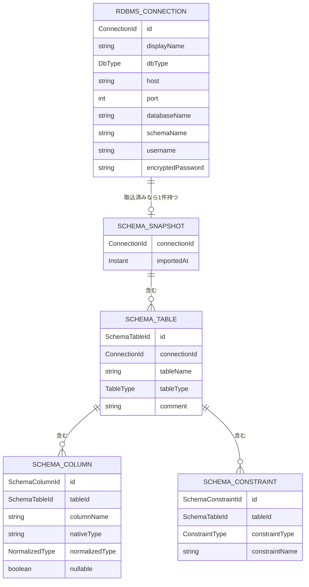

# UNIT-03 RDBMSセットアップ - Domain Entities

business-rules.mdで定義したルールに対応するドメインエンティティを定義する。永続化技術（テーブル定義・カラム型等）の詳細はNFR Design／Code Generationステージで確定する。ここでは論理的な属性・関係のみを扱う。

---

## 1. RdbmsConnection

対象RDBMSへの接続情報（BR-RDBMS-01〜03）。

| 属性 | 型 | 説明 |
|---|---|---|
| `id` | ConnectionId | 一意識別子 |
| `displayName` | String | 管理画面上での表示名 |
| `dbType` | DbType | `MYSQL`/`MARIADB`/`POSTGRESQL`/`H2` |
| `host` | String | 接続先ホスト名 |
| `port` | int | 接続先ポート番号（1〜65535） |
| `databaseName` | String | 接続先データベース名 |
| `schemaName` | String（nullable） | 接続先スキーマ名（データベースと別にスキーマの概念を持つ方言（PostgreSQL, H2）でのみ使用。レビューによりH2も対象と確認。MySQL/MariaDBはデータベース＝スキーマの単位のためnull） |
| `username` | String | 接続ユーザ名 |
| `encryptedPassword` | String | 可逆暗号化されたパスワード（AES-256-GCM。IV・認証タグを含む形式。詳細はnfr-design/logical-components.md参照） |
| `encryptionKeyId` | int | パスワード暗号化に使用した鍵の世代（NFR Design、鍵ローテーション対応のため追加。nfr-requirements/tech-stack-decisions.md §1参照） |
| `additionalParams` | String（nullable） | JDBC URLに付加するクエリパラメータ（BR-RDBMS-10、例: `useSSL=false&serverTimezone=UTC`。生の文字列としてそのままJDBC URLへ付加する） |
| `createdAt` | Instant | 登録日時 |
| `updatedAt` | Instant | 直近更新日時 |

**不変条件**: なし（BR-RDBMS-02により、host/port/databaseNameの組み合わせに関する一意制約は設けない）。

---

## 2. SchemaSnapshot

対象接続のスキーマ取込結果全体（BR-RDBMS-08、全置換方式）。全置換方式のため、1接続につき常に最新の1件のみ存在する。

| 属性 | 型 | 説明 |
|---|---|---|
| `connectionId` | ConnectionId | 対象接続（主キーを兼ねる。1接続1スナップショット） |
| `importedAt` | Instant | 取込日時 |

**RdbmsConnectionとの関係**: RdbmsConnection 1 – 0..1 SchemaSnapshot（未取込の接続はSchemaSnapshotを持たない）。

### 2.1 SchemaTable

| 属性 | 型 | 説明 |
|---|---|---|
| `id` | SchemaTableId | 一意識別子 |
| `connectionId` | ConnectionId | 所属するSchemaSnapshot（外部キー） |
| `tableName` | String | 物理名 |
| `tableType` | TableType | `TABLE`/`VIEW` |
| `comment` | String（nullable） | コメント |

**SchemaSnapshotとの関係**: SchemaSnapshot 1 – N SchemaTable。

### 2.2 SchemaColumn（BR-RDBMS-06、Q3=C、Q4=B）

| 属性 | 型 | 説明 |
|---|---|---|
| `id` | SchemaColumnId | 一意識別子 |
| `tableId` | SchemaTableId | 所属テーブル（外部キー） |
| `columnName` | String | 物理名 |
| `ordinalPosition` | int | カラム順序 |
| `comment` | String（nullable） | コメント |
| `nativeType` | String | DB固有の型表記（例: `VARCHAR(255)`, `INT`, `TIMESTAMP`） |
| `normalizedType` | NormalizedType | `STRING`/`NUMBER`/`DATE_TIME`/`BOOLEAN`/`BINARY`/`OTHER` |
| `nullable` | boolean | NOT NULL制約の有無（`false`の場合NOT NULL） |
| `defaultValue` | String（nullable） | デフォルト値 |

**SchemaTableとの関係**: SchemaTable 1 – N SchemaColumn。

### 2.3 SchemaConstraint（BR-RDBMS-06、Q3=C）

| 属性 | 型 | 説明 |
|---|---|---|
| `id` | SchemaConstraintId | 一意識別子 |
| `tableId` | SchemaTableId | 所属テーブル（外部キー） |
| `constraintType` | ConstraintType | `PRIMARY_KEY`/`FOREIGN_KEY`/`UNIQUE`/`INDEX` |
| `constraintName` | String | 制約名 |
| `columnNames` | List\<String\> | 対象カラム（複合キー対応） |
| `referencedTable` | String（nullable） | 外部キーの参照先テーブル（`FOREIGN_KEY`のみ設定） |
| `referencedColumns` | List\<String\>（nullable） | 外部キーの参照先カラム（`FOREIGN_KEY`のみ設定） |

**SchemaTableとの関係**: SchemaTable 1 – N SchemaConstraint。

---

## 3. AuditLogEntry の拡張（UNIT-02からの継続）

UNIT-02で定義したAuditLogEntry（`aidlc-docs/construction/unit-02/functional-design/domain-entities.md` §6）に、本ユニットで追加するイベント種別を反映する。UNIT-02では`connectionId`属性を「本ユニットのイベントでは通常null（UNIT-03以降で利用）」と予約していたが、本ユニットから実際に使用を開始する。

**追加するeventType**: `CONNECTION_REGISTERED` / `CONNECTION_UPDATED` / `CONNECTION_DELETED` / `SCHEMA_IMPORTED`

| eventType | userId（操作主体） | targetResource（操作対象） | detail |
|---|---|---|---|
| `CONNECTION_REGISTERED` | 操作した管理者のID | 接続の表示名 | null |
| `CONNECTION_UPDATED` | 操作した管理者のID | 接続の表示名 | null |
| `CONNECTION_DELETED` | 操作した管理者のID | 接続の表示名 | null |
| `SCHEMA_IMPORTED` | 操作した管理者のID | 接続の表示名 | 失敗時のみ、失敗理由の概要（BR-RDBMS-04のエラー分類を流用） |

上記4種のイベントはすべて`connectionId`を設定する。

---

## エンティティ関連図

**テキスト代替（複雑な視覚コンテンツのため）**:
- RdbmsConnection（1）は、スキーマ取込済みであれば1件のSchemaSnapshot（0..1）を持つ。全置換方式のため常に最新の1件のみ
- SchemaSnapshot（1）は複数のSchemaTable（0..N）を含む
- SchemaTable（1）は複数のSchemaColumn（0..N）・複数のSchemaConstraint（0..N）を含む
- SchemaConstraintが`FOREIGN_KEY`の場合のみ、`referencedTable`/`referencedColumns`で他テーブルへの参照情報を持つ（エンティティ間の外部キー関係としては表現せず、属性値として保持する）
