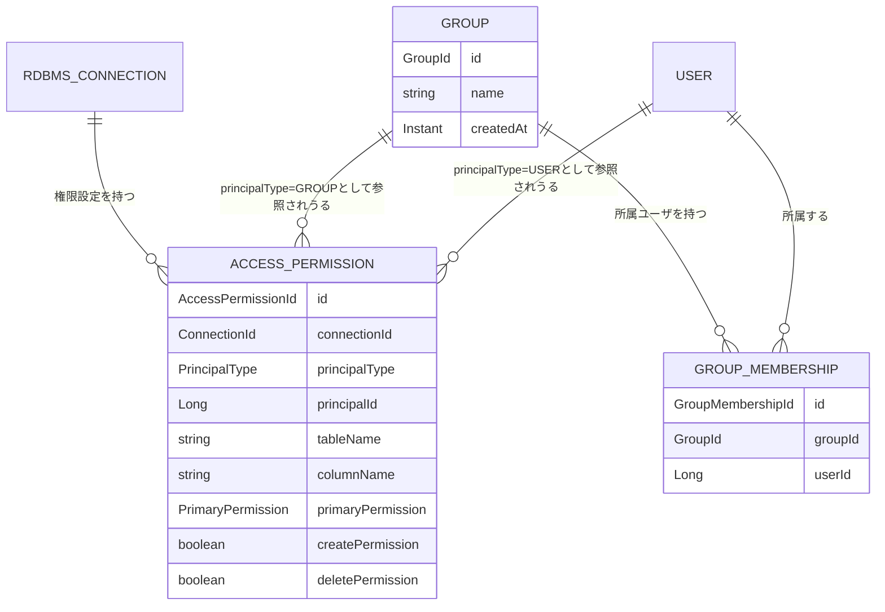

# UNIT-04 アクセス制御 - Domain Entities

business-rules.mdで定義したルールに対応するドメインエンティティを定義する。永続化技術（テーブル定義・インデックス等）の詳細はNFR Design／Code Generationステージで確定する。ここでは論理的な属性・関係のみを扱う。

---

## 1. AccessPermission（BR-ACCESS-01〜03）

あるプリンシパル（ユーザまたはグループ）が、ある接続の、あるリソース階層（接続全体／テーブル／カラム）に対して持つ、明示的な権限設定。エントリが存在すること自体が「明示的に設定されている」ことを意味し、存在しない場合は「未設定」（グループ合成またはデフォルト値`NONE`に委ねる、Q4=A・BR-ACCESS-03）を表す。

| 属性 | 型 | 説明 |
|---|---|---|
| `id` | AccessPermissionId | 一意識別子 |
| `connectionId` | ConnectionId | 対象接続（`RdbmsConnection`、UNIT-03） |
| `principalType` | PrincipalType | `USER`/`GROUP`（Q3=A） |
| `principalId` | Long | `principalType=USER`なら`User.id`、`GROUP`なら`Group.id` |
| `tableName` | String（nullable） | 対象テーブル名。`null`の場合は接続全体（スキーマ階層相当、§前提参照）に対する設定 |
| `columnName` | String（nullable） | 対象カラム名。`null`の場合はテーブル階層（または`tableName`もnullなら接続全体）に対する設定。設定する場合`tableName`も必須 |
| `primaryPermission` | PrimaryPermission | `NONE`/`READ`/`UPDATE` |
| `createPermission` | boolean | `CREATE`補助権限。`columnName`が設定されている行では常に`false`（カラム階層には設定不可、FR-2.5） |
| `deletePermission` | boolean | `DELETE`補助権限。`columnName`が設定されている行では常に`false`（同上） |
| `updatedAt` | Instant | 直近更新日時 |
| `updatedBy` | Long | 更新した管理者のUserId |

**一意制約**: (`connectionId`, `principalType`, `principalId`, `tableName`, `columnName`)の組み合わせで一意（同一キーへの再設定はupsert、業務ロジック側で保証）。

**リソース対象の保持方式（Q2=A）**: `tableName`/`columnName`はUNIT-03の`SchemaTable`/`SchemaColumn`への外部キーではなく、名前の文字列として独立して保持する。スキーマ再取込（UNIT-03のBR-RDBMS-08、全置換）があっても権限設定はそのまま保持される。再取込後に対象テーブル／カラムが存在しなくなっていた場合、実効権限判定時にそのリソース自体が参照されないため実害はない（対象が存在しなければ操作自体が成立しないため）。

---

## 2. Group（FR-2.13〜FR-2.15）

| 属性 | 型 | 説明 |
|---|---|---|
| `id` | GroupId | 一意識別子 |
| `name` | String | グループ名（一意） |
| `createdAt` | Instant | 作成日時 |

---

## 3. GroupMembership（FR-2.14）

グループとユーザの所属関係。

| 属性 | 型 | 説明 |
|---|---|---|
| `id` | GroupMembershipId | 一意識別子 |
| `groupId` | GroupId | 所属グループ（外部キー） |
| `userId` | Long | 所属ユーザ（`User.id`、外部キー） |

**一意制約**: (`groupId`, `userId`)の組み合わせで一意（同一ユーザを同一グループに重複追加しない）。

**Groupとの関係**: Group 1 – N GroupMembership。Groupを削除する場合、関連するGroupMembershipおよび当該グループを`principalId`とする`AccessPermission`をあわせてカスケード削除する（FR-2.13、BR-ACCESS-11）。

---

## 4. AuditLogEntry の拡張（UNIT-02からの継続）

UNIT-02で定義したAuditLogEntry（`aidlc-docs/construction/unit-02/functional-design/domain-entities.md` §6）に、本ユニットで追加するイベント種別を反映する。

**追加するeventType**（Q7=A、requirements.md §6.1が要求する4分類「グループ変更・権限設定変更・YAMLエクスポート・YAMLインポート」を、グループ変更をさらに操作単位で細分化して記録する）:

| eventType | userId（操作主体） | targetResource（操作対象） | detail |
|---|---|---|---|
| `PERMISSION_CHANGED` | 操作した管理者のID | プリンシパル種別・名前＋対象リソース（接続の表示名/テーブル名/カラム名） | 設定内容（主権限・補助権限の変更後の値） |
| `GROUP_CREATED` | 操作した管理者のID | グループ名 | null |
| `GROUP_RENAMED` | 操作した管理者のID | 変更後のグループ名 | 変更前のグループ名 |
| `GROUP_DELETED` | 操作した管理者のID | グループ名 | null |
| `GROUP_MEMBER_ADDED` | 操作した管理者のID | グループ名 | 追加されたユーザのemail |
| `GROUP_MEMBER_REMOVED` | 操作した管理者のID | グループ名 | 削除されたユーザのemail |
| `PERMISSION_YAML_EXPORTED` | 操作した管理者のID | 接続の表示名 | null |
| `PERMISSION_YAML_IMPORTED` | 操作した管理者のID | 接続の表示名 | 失敗（拒否）時のみ、拒否理由の概要（未解決プリンシパル／重複エントリ） |

`PERMISSION_CHANGED`・`PERMISSION_YAML_EXPORTED`・`PERMISSION_YAML_IMPORTED`は`connectionId`を設定する。グループ関連の4種は`connectionId`を設定しない（グループは接続に紐づかない全体管理概念のため）。

---

## エンティティ関連図

**テキスト代替（複雑な視覚コンテンツのため）**:
- `RdbmsConnection`（UNIT-03、1）は複数の`AccessPermission`（0..N）を持つ
- `Group`（1）は複数の`GroupMembership`（0..N）を持ち、複数の`AccessPermission`（0..N、`principalType=GROUP`かつ`principalId=`自身の`id`）から参照されうる
- `User`（UNIT-02、1）は複数の`GroupMembership`（0..N）に属し、複数の`AccessPermission`（0..N、`principalType=USER`）から参照されうる
- `AccessPermission`の`principalId`は`principalType`の値に応じて`User.id`または`Group.id`のいずれかを指す（多態的な外部キーであり、DB上は単純な数値列としてのみ保持し、参照整合性はアプリケーション側で保証する）
