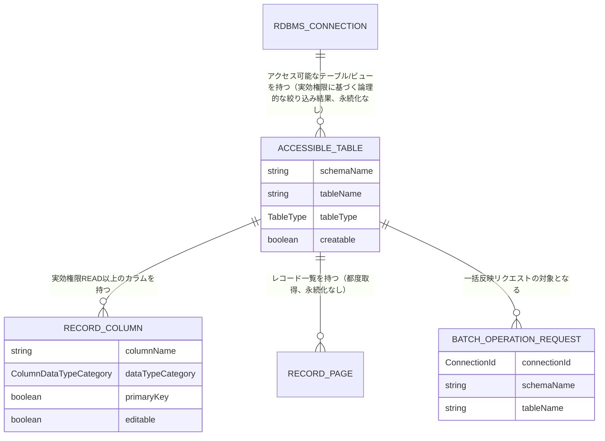

# UNIT-05 マスタメンテナンス - Domain Entities

business-rules.mdで定義したルールに対応するドメインモデルを定義する。永続化技術（テーブル定義等）の詳細はNFR Design／Code Generationステージで確定する。

**内部DBへの新規永続化エンティティなし（Q9=A）**: マスタデータ自体は対象RDBMS側にあり、内部DBには保存しない。一覧・絞込・編集の状態はすべてリクエスト単位・フロントエンドの一時状態で完結する。以下は内部DBに永続化しないリクエスト/レスポンスの論理モデル（値オブジェクト）と、UNIT-02の`AuditLogEntry`への拡張のみを扱う。

---

## 1. AccessibleConnection（BR-MASTER-13）

一般ユーザ向け「アクセス可能な接続」一覧の1件。

| 属性 | 型 | 説明 |
|---|---|---|
| `connectionId` | ConnectionId | 対象接続（UNIT-03の`RdbmsConnection.id`） |
| `displayName` | String | 接続の表示名（技術的詳細は含めない、Q17=A） |

---

## 2. AccessibleTable（BR-MASTER-01〜02）

アクセス可能なテーブル/ビュー一覧の1件。

| 属性 | 型 | 説明 |
|---|---|---|
| `schemaName` | String | スキーマ名 |
| `tableName` | String | テーブル/ビュー名 |
| `tableType` | TableType | `TABLE`/`VIEW`（UNIT-03） |
| `creatable` | boolean | `canCreate()`の結果。`VIEW`は常に`false` |

---

## 3. RecordColumn（BR-MASTER-14）

レコード一覧・詳細に含める1カラムのメタデータ。実効主権限が`NONE`のカラムはこのモデル自体を生成しない（レスポンスから完全除外）。

| 属性 | 型 | 説明 |
|---|---|---|
| `columnName` | String | カラム名 |
| `dataTypeCategory` | ColumnDataTypeCategory | `NUMERIC`/`DATETIME`/`STRING`/`BOOLEAN`等（BR-MASTER-05のフィルタ演算子決定に使用） |
| `primaryKey` | boolean | 主キー構成列か |
| `editable` | boolean | 実効主権限が`UPDATE`か（`true`ならインライン編集可） |

---

## 4. RecordFilterCondition（BR-MASTER-05）

フィルタUIで指定する絞込条件。

| 属性 | 型 | 説明 |
|---|---|---|
| `columnName` | String | 対象カラム |
| `operator` | FilterOperator | `EQ`/`LT`/`LE`/`GT`/`GE`/`BETWEEN`/`STARTS_WITH`/`CONTAINS` |
| `value` | String | 比較値（BR-MASTER-09により文字列表現） |
| `valueTo` | String（nullable） | `BETWEEN`の上限値 |

## 5. RawQueryCondition（BR-MASTER-04）

SQL手入力によるWHERE/ORDER BY句。

| 属性 | 型 | 説明 |
|---|---|---|
| `whereClause` | String（nullable） | 手入力のWHERE句（構文検証・パラメータ化を経て使用） |
| `orderByClause` | String（nullable） | 手入力のORDER BY句 |

---

## 6. RecordPage（BR-MASTER-10）

レコード一覧取得の結果。

| 属性 | 型 | 説明 |
|---|---|---|
| `columns` | List\<RecordColumn\> | 表示対象カラムのメタデータ |
| `rows` | List\<Map\<String, String\>\> | レコード本体（カラム名→文字列値。BR-MASTER-09） |
| `page` | int | ページ番号 |
| `pageSize` | int | 1ページあたり件数 |
| `totalCount` | long | 総件数 |

---

## 7. BatchOperationRequest / BatchOperationItem（BR-MASTER-06〜09）

一括反映APIのリクエスト。

**BatchOperationRequest**

| 属性 | 型 | 説明 |
|---|---|---|
| `connectionId` | ConnectionId | 対象接続 |
| `schemaName` | String | 対象スキーマ |
| `tableName` | String | 対象テーブル |
| `operations` | List\<BatchOperationItem\> | バッチ内の各行操作 |

**BatchOperationItem**

| 属性 | 型 | 説明 |
|---|---|---|
| `operationType` | OperationType | `CREATE`/`UPDATE`/`DELETE` |
| `primaryKeyValues` | Map\<String, String\>（nullable） | 対象行の識別キー（`UPDATE`/`DELETE`で必須、BR-MASTER-08） |
| `columnValues` | Map\<String, String\>（nullable） | 設定するカラム値（`CREATE`/`UPDATE`で必須） |

---

## 8. BatchOperationResult / BatchOperationItemResult（BR-MASTER-07）

**BatchOperationResult**

| 属性 | 型 | 説明 |
|---|---|---|
| `success` | boolean | バッチ全体の成否 |
| `itemResults` | List\<BatchOperationItemResult\> | 各行操作の結果（失敗時のみ内容を持つ） |

**BatchOperationItemResult**

| 属性 | 型 | 説明 |
|---|---|---|
| `index` | int | バッチ内のインデックス |
| `errorCode` | String | `PERMISSION_DENIED`/`CONSTRAINT_VIOLATION`/`INVALID_VALUE`等 |
| `errorMessage` | String | エラー内容の説明 |

---

## 9. AuditLogEntry の拡張（UNIT-02からの継続）

UNIT-02で定義したAuditLogEntry（`aidlc-docs/construction/unit-02/functional-design/domain-entities.md` §6）に、本ユニットで追加するイベント種別を反映する。

**追加するeventType**（BR-MASTER-12、requirements.md §6.1「データアクセスイベント」対応）:

| eventType | userId（操作主体） | targetResource（操作対象） | detail |
|---|---|---|---|
| `MASTER_DATA_BULK_ACCESSED` | 操作したユーザのID | 接続の表示名／スキーマ名／テーブル名 | 取得件数、絞込条件の概要（SQL手入力の場合はその旨） |
| `MASTER_DATA_BATCH_APPLIED` | 操作したユーザのID | 接続の表示名／スキーマ名／テーブル名 | バッチ内の操作件数（作成/更新/削除の内訳） |

いずれも`connectionId`を設定する。

---

## エンティティ関連図

**テキスト代替（複雑な視覚コンテンツのため）**:
- `RdbmsConnection`（UNIT-03、1）配下に、実効権限判定の結果として動的に導出される複数の`AccessibleTable`（0..N）がある（DB上の実体ではなく、都度の判定結果）
- 各`AccessibleTable`は複数の`RecordColumn`（0..N、実効主権限READ以上のもののみ）を持つ
- 各`AccessibleTable`に対して、都度の`RecordPage`（レコード一覧取得結果）や`BatchOperationRequest`（一括反映リクエスト）が発生しうるが、いずれも内部DBには永続化しない
