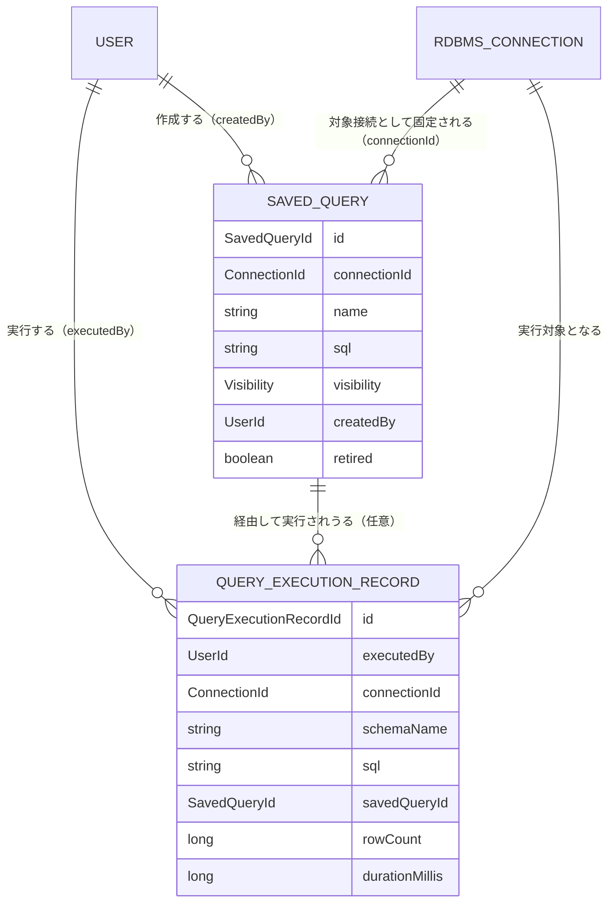

# UNIT-06 クエリ保存・実行 - Domain Entities

business-rules.mdで定義したルールに対応するドメインモデルを定義する。永続化技術（テーブル定義等）の詳細はNFR Design／Code Generationステージで確定する。

**内部DBへの新規永続化エンティティあり**: 本ユニットはUNIT-05と異なり、`SavedQuery`（保存クエリ）と`QueryExecutionRecord`（実行記録、Q1=A）を内部DBに新規永続化する。対象RDBMS側のデータ（SELECT結果）自体は永続化しない。

---

## 1. SavedQuery（BR-QUERY-05〜09）

保存クエリ本体（STORY-6.1〜6.2）。

| 属性 | 型 | 説明 |
|---|---|---|
| `id` | SavedQueryId | 一意識別子 |
| `connectionId` | ConnectionId | 対象RDBMS接続（保存時点で固定。Q11） |
| `name` | String | クエリ名 |
| `sql` | String | 保存されたSQL（読み取り専用検証を通過済み） |
| `visibility` | Visibility | `PUBLIC` / `PRIVATE` |
| `createdBy` | UserId | 作成者 |
| `retired` | boolean | 非表示化されているか（論理削除、BR-QUERY-08） |
| `createdAt` | Instant | 作成日時 |
| `updatedAt` | Instant | 最終更新日時 |

**接続に紐付ける・スキーマは保持しない**（Q11、FR-6.3）: `SavedQuery`は対象接続（`connectionId`）を保存時点で固定するが、スキーマ名は属性として持たない。実行時は、固定された接続内でその時点の実行者が実効主権限`READ`以上を持つスキーマの中から選択する（`QueryExecutionRecord`参照）。

**Userとの関係**: User 1 – N SavedQuery（`createdBy`）
**RdbmsConnectionとの関係**: RdbmsConnection 1 – N SavedQuery（`connectionId`、保存時点で固定・変更不可）

---

## 2. QueryExecutionRecord（BR-QUERY-10、STORY-7.3、Q1=A）

クエリ実行1回分の記録。ユーザ向け実行履歴（UNIT-08が閲覧機能を追加）の基礎データ。

| 属性 | 型 | 説明 |
|---|---|---|
| `id` | QueryExecutionRecordId | 一意識別子 |
| `executedBy` | UserId | 実行者 |
| `connectionId` | ConnectionId | 対象接続 |
| `schemaName` | String | 実行時に指定した対象スキーマ |
| `sql` | String | 実行したSQL |
| `params` | String（nullable） | バインドしたパラメータ（名前→値、JSON文字列として保持） |
| `savedQueryId` | SavedQueryId（nullable） | 保存クエリ経由で実行した場合の参照。ad-hoc実行の場合はnull |
| `rowCount` | long | 結果件数 |
| `durationMillis` | long | 実行時間（ミリ秒） |
| `executedAt` | Instant | 実行日時 |

**Userとの関係**: User 1 – N QueryExecutionRecord（`executedBy`）
**SavedQueryとの関係**: SavedQuery 0..1 – N QueryExecutionRecord（`savedQueryId`、ad-hoc実行時はnull）

---

## 3. Visibility（値オブジェクト）

| 値 | 説明 |
|---|---|
| `PUBLIC` | 認証済みユーザなら誰でも参照・実行可能 |
| `PRIVATE` | 作成者のみ参照・実行・編集・非表示化可能 |

---

## 4. QueryParameter（永続化しない値オブジェクト）

SQL文字列から都度検出するパラメータ（Q5=A）。永続化せず、実行のたびにSQLを解析して導出する。

| 属性 | 型 | 説明 |
|---|---|---|
| `name` | String | `:name`形式のパラメータ名（`JdbcNamedParameter`ノードから収集） |
| `value` | String | ユーザが入力した値（型解決はJDBCドライバのデフォルト動作に委ねる） |

---

## 5. QueryResult（永続化しない値オブジェクト）

クエリ実行結果（STORY-7.3）。

| 属性 | 型 | 説明 |
|---|---|---|
| `columns` | List\<String\> | 結果セットの列名（動的、SELECT対象により変化） |
| `rows` | List\<Map\<String, String\>\> | 結果行（列名→文字列値） |
| `page` | int（nullable） | ページ番号（ページング有効時のみ） |
| `pageSize` | int（nullable） | 1ページあたり件数（ページング有効時のみ） |
| `totalCount` | long（nullable） | 総件数（ページング有効時のみ） |
| `rowCount` | long | 返却された行数（ページング無効時は結果全体の件数） |
| `durationMillis` | long | 実行時間 |

---

## 6. AuditLogEntry の拡張（UNIT-02からの継続）

UNIT-02で定義した`AuditLogEntry`（`aidlc-docs/construction/unit-02/functional-design/domain-entities.md` §6）に、本ユニットで追加するイベント種別を反映する。

**追加するeventType**（BR-QUERY-10、requirements.md §6.1「データアクセスイベント」対応）:

| eventType | userId（操作主体） | targetResource（操作対象） | detail |
|---|---|---|---|
| `QUERY_EXECUTED` | 実行したユーザのID | 接続の表示名／スキーマ名 | 実行したSQLの概要、結果件数 |
| `QUERY_SAVED` | 保存したユーザのID | 保存クエリ名 | 公開範囲（PUBLIC/PRIVATE） |
| `QUERY_UPDATED` | 更新したユーザ（作成者）のID | 保存クエリ名 | null |
| `QUERY_RETIRED` | 非表示化したユーザ（作成者）のID | 保存クエリ名 | null |

いずれも`connectionId`を設定する（`QUERY_SAVED`/`QUERY_UPDATED`/`QUERY_RETIRED`はスキーマを持たないため接続IDのみ）。

---

## エンティティ関連図

**テキスト代替（複雑な視覚コンテンツのため）**:
- `User`（1）は複数の`SavedQuery`（0..N、`createdBy`）を作成しうる
- `User`（1）は複数の`QueryExecutionRecord`（0..N、`executedBy`）を実行しうる
- `RdbmsConnection`（UNIT-03、1）は複数の`SavedQuery`（0..N、`connectionId`）の対象接続として固定されうる（保存時点で決まり、変更不可）
- `SavedQuery`（0..1、ad-hoc実行時はなし）は複数の`QueryExecutionRecord`（0..N）の実行元になりうる
- `RdbmsConnection`（UNIT-03、1）は複数の`QueryExecutionRecord`（0..N）の実行対象になりうる
