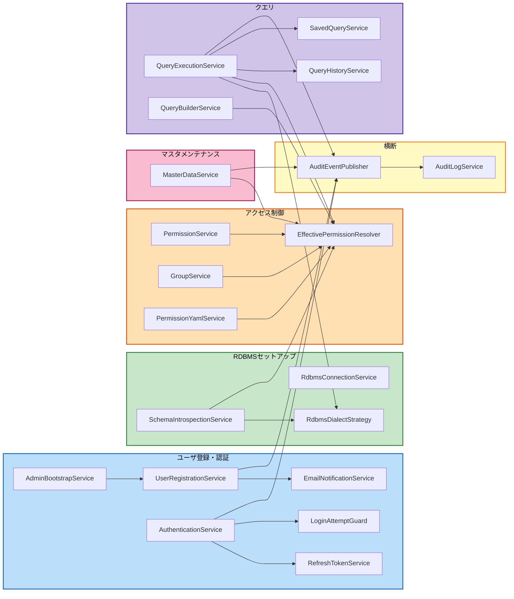

# コンポーネント依存関係

## 依存関係マトリクス

| コンポーネント | 依存先 |
|---|---|
| UserRegistrationService | EmailNotificationService, AuditEventPublisher |
| AdminBootstrapService | UserRegistrationService（`createApprovedAccount()`等の専用メソッド経由。パスワードハッシュ化等の共通ロジックを再利用し、通常の登録フロー（トークン発行〜承認）を経ずに承認済みアカウントを作成する） |
| AuthenticationService | RefreshTokenService, LoginAttemptGuard, AuditEventPublisher |
| RefreshTokenService | AuditEventPublisher |
| LoginAttemptGuard | （なし、独立） |
| EmailNotificationService | （なし、外部SMTP連携のみ） |
| RdbmsConnectionService | AuditEventPublisher |
| SchemaIntrospectionService | RdbmsDialectStrategy, EffectivePermissionResolver（キャッシュ無効化）, AuditEventPublisher |
| RdbmsDialectStrategy | （なし、独立戦略実装） |
| ~~AccessControlService~~ 訂正（UNIT-04 Functional Design／NFR Designにて）: GroupService／PermissionService（2コンポーネントに分割、命名一貫性のためPermissionServiceに改称） | EffectivePermissionResolver（キャッシュ無効化）, AuditEventPublisher |
| EffectivePermissionResolver | （なし、内部キャッシュのみ） |
| PermissionYamlService | EffectivePermissionResolver（キャッシュ無効化）, AuditEventPublisher |
| MasterDataService | EffectivePermissionResolver, AuditEventPublisher |
| QueryExecutionService | RdbmsDialectStrategy, EffectivePermissionResolver, QueryHistoryService, SavedQueryService, AuditEventPublisher |
| SavedQueryService | AuditEventPublisher |
| QueryBuilderService | EffectivePermissionResolver |
| QueryHistoryService | （なし、記録先として参照される） |
| AuditLogService | AuditEventPublisherからのイベントを受信（呼び出し元ではなく受信側） |
| AuditEventPublisher | AuditLogService（イベント経由） |

## データフロー（横断的コンポーネント中心）

- **EffectivePermissionResolver**: SchemaIntrospectionService／~~AccessControlService~~ 訂正: GroupService・PermissionService／PermissionYamlServiceから「キャッシュ無効化」の呼び出しを受け、MasterDataService／QueryBuilderService／QueryExecutionServiceから「権限判定」の呼び出しを受ける。書き込み側と読み取り側が明確に分離されている（**訂正（UNIT-04 NFR Designにて）**: 「呼び出し」は概念上の依存関係であり、実装は各書き込み側メソッドへの`@CacheEvict(allEntries=true)`宣言的アノテーションによる）
- **RdbmsDialectStrategy**: SchemaIntrospectionServiceとQueryExecutionServiceの両方から、対象RDBMSの種別に応じた方言処理を取得するために参照される
- **AuditEventPublisher / AuditLogService**: ほぼ全てのドメインサービスがイベント発行元となり、AuditLogServiceのみが受信側となる一方向のファンイン構造

## 依存関係図（Mermaid）



**訂正（UNIT-04 Functional Design／NFR Designにて）**: `AccessControlService`（C10）は`PermissionService`（`GroupService`との命名一貫性のため改称）と`GroupService`（C10B、新規）に分割された。両者の依存先は変わらない。

### テキスト代替表現

```
ユーザ登録・認証ドメイン:
  UserRegistrationService -> EmailNotificationService, AuditEventPublisher
  AdminBootstrapService -> UserRegistrationService（createApprovedAccount経由）
  AuthenticationService -> RefreshTokenService, LoginAttemptGuard, AuditEventPublisher

RDBMSセットアップドメイン:
  SchemaIntrospectionService -> RdbmsDialectStrategy, EffectivePermissionResolver(invalidate)

アクセス制御ドメイン:
  PermissionService -> EffectivePermissionResolver(invalidate)
  GroupService -> EffectivePermissionResolver(invalidate)
  PermissionYamlService -> EffectivePermissionResolver(invalidate)

マスタメンテナンスドメイン:
  MasterDataService -> EffectivePermissionResolver(resolve), AuditEventPublisher

クエリドメイン:
  QueryExecutionService -> RdbmsDialectStrategy, EffectivePermissionResolver(resolve),
                            QueryHistoryService, SavedQueryService, AuditEventPublisher
  QueryBuilderService -> EffectivePermissionResolver(resolve)

横断:
  AuditEventPublisher -> AuditLogService（全ドメインからのファンイン）
```

## 循環依存の確認

上記マトリクスに循環参照は存在しない。EffectivePermissionResolver・RdbmsDialectStrategy・AuditEventPublisher/AuditLogServiceはいずれも「参照される側」に徹しており、ドメインサービス側へ依存を持たない設計とした。
