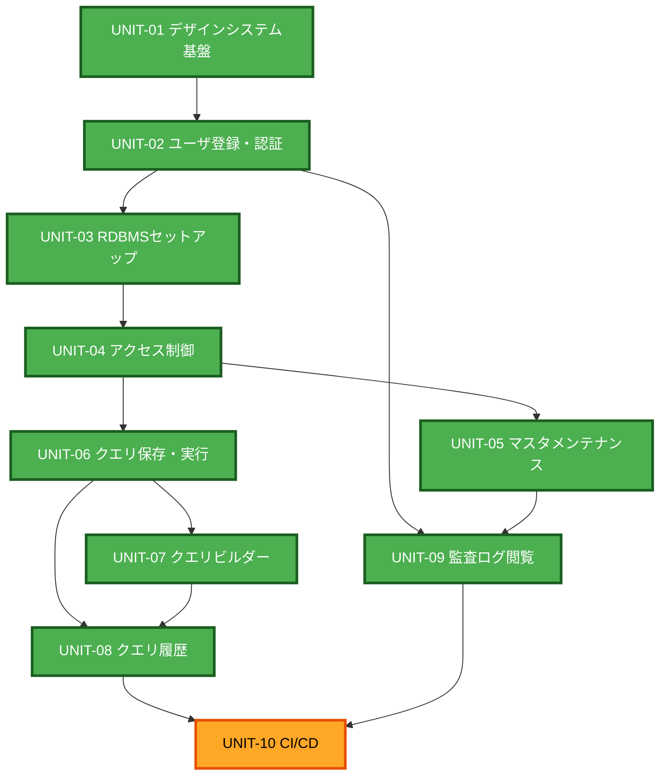

# Unit of Work 依存関係

## 依存関係マトリクス

| ユニット | 前提ユニット | 前提理由 |
|---|---|---|
| UNIT-01 デザインシステム基盤 | なし | 最初に着手 |
| UNIT-02 ユーザ登録・認証 | UNIT-01 | 共通UIコンポーネントを利用 |
| UNIT-03 RDBMSセットアップ | UNIT-01, UNIT-02 | 管理者ログイン・監査ログ記録基盤が必要 |
| UNIT-04 アクセス制御 | UNIT-01, UNIT-02, UNIT-03 | 取込済みスキーマに対して権限を設定するため |
| UNIT-05 マスタメンテナンス | UNIT-01〜UNIT-04 | 実効権限判定（EffectivePermissionResolver）に依存 |
| UNIT-06 クエリ保存・実行 | UNIT-01〜UNIT-04 | RdbmsDialectStrategy・実効権限判定に依存 |
| UNIT-07 クエリビルダー | UNIT-01〜UNIT-04, UNIT-06 | 生成SQLの実行・保存への連携を本実装するため |
| UNIT-08 クエリ履歴 | UNIT-01〜UNIT-04, UNIT-06, UNIT-07 | 実行記録の蓄積、遷移先（実行・保存・ビルダー）が必要 |
| UNIT-09 監査ログ閲覧 | UNIT-01, UNIT-02 | UNIT-02で構築した記録基盤に蓄積されたログを閲覧するため |
| UNIT-10 CI/CD | UNIT-01〜UNIT-09すべて | 全機能が揃った最終段階でビルド・リリース自動化を行う |

## 着手順序（Q2=A、厳密な逐次実行）

```
UNIT-01 → UNIT-02 → UNIT-03 → UNIT-04 → UNIT-05 → UNIT-06 → UNIT-07 → UNIT-08 → UNIT-09 → UNIT-10
```

UNIT-09（監査ログ閲覧）は前提としてはUNIT-01・UNIT-02のみで着手可能だが、閲覧対象のログが他ユニットの操作によって蓄積されることを踏まえ、他の機能ユニット（UNIT-03〜UNIT-08）の後、UNIT-10の前に配置する。

## 依存関係図（Mermaid）



### テキスト代替表現

```
UNIT-01 デザインシステム基盤
  -> UNIT-02 ユーザ登録・認証
       -> UNIT-03 RDBMSセットアップ
            -> UNIT-04 アクセス制御
                 -> UNIT-05 マスタメンテナンス ---\
                 -> UNIT-06 クエリ保存・実行        |
                      -> UNIT-07 クエリビルダー      |
                           -> UNIT-08 クエリ履歴     |
       -> UNIT-09 監査ログ閲覧（UNIT-02から直接、UNIT-05以降と合流）--/
UNIT-08, UNIT-09 -> UNIT-10 CI/CD（最終）
```

## 循環依存の確認

上記に循環参照は存在しない。UNIT-01からUNIT-10まで単方向に依存が積み上がる構造であり、Q2=A（厳密な逐次実行）とも整合する。
