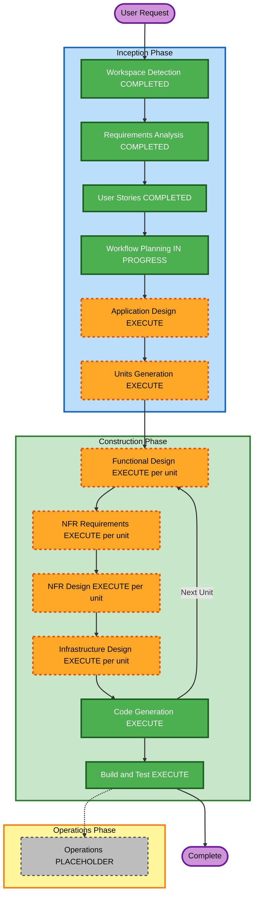

# Execution Plan

## 詳細分析サマリ

**プロジェクト種別**: Greenfield（既存システムなし）。ブラウンフィールド固有の分析項目（Transformation Scope Detection、Component Relationship Mapping、Multi-Module Coordination）はN/A。

### 変更影響評価
- **ユーザ向け変更**: あり — アプリ全体がユーザ向け機能（マスタメンテナンス、クエリビルダー等）
- **構造的変更**: あり（新規構築） — Spring Bootバックエンド／Reactフロントエンド／複数RDBMS連携という新規アーキテクチャをゼロから構築
- **データモデル変更**: あり — 内部DB（ユーザ、権限、クエリ等）と対象RDBMSのスキーマメタデータの両方を新規設計
- **API変更**: あり — REST API一式を新規設計（OpenAPI仕様書生成を含む）
- **NFR影響**: あり — セキュリティ拡張（SECURITY-01〜15）、PBT拡張（PBT-01〜10）、i18n、性能・デプロイ要件が全面的に関わる

### リスク評価
- **リスクレベル**: Medium — 新規構築のため既存システムへの影響・ロールバック懸念はないが、複数RDBMS方言対応・多階層アクセス権限モデル・JWTローテーションなど技術的不確実性を伴う要素が複数存在する
- **ロールバックの複雑さ**: N/A（Greenfield、本番運用前）
- **テストの複雑さ**: Moderate〜Complex — PBT全面適用対象（権限判定、YAML入出力、SQL生成）を含む

---

## ワークフロー可視化



### テキスト代替表現

```
INCEPTIONフェーズ
- Workspace Detection: 完了
- Requirements Analysis: 完了
- User Stories: 完了
- Workflow Planning: 進行中（本ドキュメント）
- Application Design: 実施予定
- Units Generation: 実施予定

CONSTRUCTIONフェーズ（ユニットごとに繰り返し）
- Functional Design: ユニットごとに実施判定（複雑なロジックを持つユニットは実施）
- NFR Requirements: ユニットごとに実施判定
- NFR Design: ユニットごとに実施判定
- Infrastructure Design: ユニットごとに実施判定
- Code Generation: 必ず実施
Build and Test: 全ユニット完了後に必ず実施

OPERATIONSフェーズ
- Operations: プレースホルダー（未実装）
```

---

## 実施ステージ

### 🔵 INCEPTION PHASE
- [x] Workspace Detection（完了）
- [x] Requirements Analysis（完了・承認済み）
- [x] User Stories（完了・承認済み）
- [x] Workflow Planning（本ドキュメント）
- [ ] Application Design — **EXECUTE**
  - **根拠**: 認証・権限判定・スキーマ取込・クエリビルダー・監査ログなど多数の新規サービス層コンポーネントが必要で、それぞれの責務・依存関係・主要メソッドを事前に定義しておくことで、単独開発者がユニットをまたいで一貫したアーキテクチャを維持しやすくなる
- [ ] Units Generation — **EXECUTE**
  - **根拠**: requirements.mdの実装優先順位・stories.mdの10エピック構成から、複数の実装ユニットへの分解が明らかに必要（デザインシステム基盤、ユーザ管理、RDBMSセットアップ、アクセス制御、データ表示、その他機能、監査ログ、CI/CD等）

### 🟢 CONSTRUCTION PHASE（ユニットごとに繰り返し）
- [ ] Functional Design — **EXECUTE（ユニットごとに判定）**
  - **根拠**: アクセス権限判定・合成ロジック（PBT対象）、SQL生成ロジック（PBT対象）、JWTローテーション等、詳細設計が必要な複雑ロジックを含むユニットが多い
- [ ] NFR Requirements — **EXECUTE（ユニットごとに判定）**
  - **根拠**: セキュリティ拡張・PBT拡張の適用、テストフレームワーク（jqwik等）選定、多言語基盤選定など、ユニットごとに技術スタックの詳細確認が必要
- [ ] NFR Design — **EXECUTE（ユニットごとに判定）**
  - **根拠**: NFR Requirementsで特定されたセキュリティ・PBTパターンを各ユニットの設計に反映する必要がある
- [ ] Infrastructure Design — **EXECUTE（ユニットごとに判定、特にRDBMSセットアップ・CI/CDユニットで重点的に）**
  - **根拠**: 複数RDBMS対応のコネクションプール構成、devenv（Docker Compose）、自己完結型WAR、Dockerコンテナ化、GitHub Actions（最終ユニット）など、インフラ設計が必要な要素が複数ある
- [ ] Code Generation — **EXECUTE（ALWAYS）**
  - **根拠**: 全ユニットで実装・テストコード生成が必要
- [ ] Build and Test — **EXECUTE（ALWAYS）**
  - **根拠**: 全ユニット完了後にビルド・ユニットテスト・統合テストの実行手順を整備する必要がある（NFR-9.1〜9.2, NFR-10.1）

### 🟡 OPERATIONS PHASE
- [ ] Operations — PLACEHOLDER
  - **根拠**: 現時点で本ワークフローの対象外（将来拡張用）

---

## ユニット分割の見通し（Units Generationステージで正式決定）

stories.mdのエピック構成・requirements.mdの実装優先順位に基づく暫定的な見通し（正式なユニット定義はUnits Generationステージで確定する）:

1. デザインシステム基盤（P0）
2. ユーザ登録・認証（P1、Epic1+3）
3. 対象RDBMSセットアップ（P2、Epic2の接続・スキーマ取込部分）
4. アクセス制御（P3、Epic2の権限モデル部分。PBT対象を含む）
5. マスタメンテナンス（P4、Epic4）
6. クエリビルダー・保存・実行・履歴（P5、Epic5〜8。PBT対象を含む）
7. 監査ログ閲覧（P4〜P5、Epic9）
8. CI/CD（GitHub Actions・タグpushリリース、最終ユニット、NFR-10.x）

---

## 推定タイムライン

AI-DLCはステージ／ユニット単位で進行を管理し、暦日での工数見積りは行わない。上記の見通しでは8ユニット程度になる想定だが、正式な数と粒度はUnits Generationステージで確定する。単独開発者による段階的実装（MVPファースト）のため、各ユニットは前のユニットの完了後に順次着手する想定。

## 成功基準

- **主目的**: requirements.mdの機能要件・非機能要件を満たすマスタデータメンテナンスアプリケーションの構築
- **主要成果物**: 各ユニットの設計文書・実装コード・テストコード、Build and Testステージでのビルド/テスト手順書
- **品質ゲート**: セキュリティ拡張（SECURITY-01〜15）およびPBT拡張（PBT-01〜10）の各ステージでのコンプライアンス確認（非準拠はブロッキング指摘として解消必須）、各ステージでのユーザ承認ゲート
